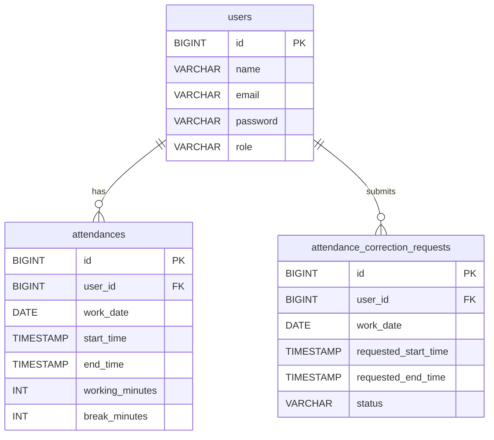

# 勤怠管理Webアプリ

Java/Spring Bootを用いたログイン機能付きの勤怠管理Webアプリです。通常ユーザーは自分の勤怠を管理し、管理者は修正申請を承認できます。業務ルールをService層に集約し、Controller/Service/Repositoryの分離を徹底しています。

## 概要
- 出勤/退勤の打刻
- 日次・月次の勤怠表示
- 勤怠修正申請
- 管理者による修正承認
- 6時間以上の勤務で休憩60分を自動控除

## 技術スタック
- Java 17
- Spring Boot / Spring MVC
- Spring Security（フォームログイン）
- Spring Data JPA
- Thymeleaf
- Maven
- H2（開発用DB）

## 画面
- ログイン画面（`/login`）
- 打刻画面（`/attendances`）
- 日次勤怠画面（`/attendances/daily`）
- 勤怠一覧画面（`/attendances/month`）
- 修正申請画面（`/corrections`）
- 修正申請一覧（管理者） (`/admin/corrections`)

## ディレクトリ構成
```
src/main/java/com/example/attendance
├─ config
├─ controller
├─ entity
├─ exception
├─ repository
└─ service
src/main/resources
├─ templates
└─ static/css
```

## ER図


## 主な業務ルール
- 出勤は1日1回のみ
- 退勤は出勤後のみ可能
- 勤務時間は startTime〜endTime の差分（分単位）
- 6時間以上の勤務は休憩60分を自動控除
- 修正申請の承認時は user + workDate で Attendance を取得して更新
- AttendanceCorrectionRequest に Attendance ID は持たせない

## 起動方法
1. ルートへ移動
   ```bash
   cd /Users/xxx/Desktop/Projects/attendance_management
   ```
2. 起動
   ```bash
   mvn spring-boot:run
   ```

## 初期ユーザー
- 一般ユーザー
  - `user@example.com / password`
- 管理者
  - `admin@example.com / adminpass`

## H2 Console
- `http://localhost:8080/h2-console`
- JDBC URL: `jdbc:h2:mem:attendance_db`

## デプロイ
デプロイURLは次のとおり。
<https://quixotic-shayne-nontitle-674954ce.koyeb.app/login>

### 注意点
- 現在のDBは **H2メモリ** のため、再起動でデータが消えます。
- クラウド環境に合わせるため `server.port=${PORT:8080}` を設定済みです。

## 設計ポイント（アピール）
- **Controller/Service/Repository**の責務分離
- 例外は**ControllerAdvice**で集約処理
- Optional を適切に扱い、null安全に配慮
- **業務ロジックをService層に集中**しテストしやすい構成
- **休憩控除の自動化**で実務要件を反映

## 今後の改善案
- 勤務時間の集計（総勤務時間/残業/休憩）
- バリデーション強化（Bean Validation）
- 承認・却下時の通知機能

---


